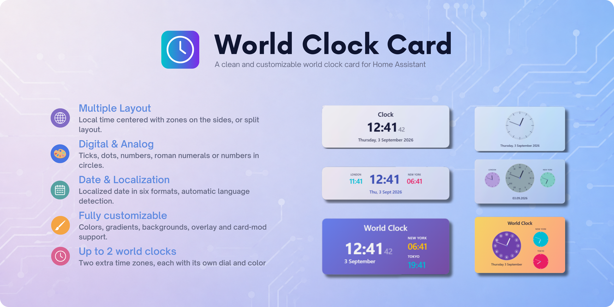

# World Clock Card

[](https://github.com/hacs/integration)
[](https://github.com/korova-sq/world-clock-card/releases)
[](https://opensource.org/licenses/MIT)
[](https://buymeacoffee.com/korova.sq)



A clean and customizable world clock card for [Home Assistant](https://www.home-assistant.io/).
Show the local time as a **digital** or **analog** clock, add up to **two extra time
zones**, and style every part of it — all from the UI editor.

---

## 🤔 What is World Clock Card?

A decorative yet practical clock for your dashboard. Pick a digital or analog face,
choose how the dial looks (ticks, dots, numbers, roman numerals or numbers-in-circles),
add a localized date in the format you like, and drop in a couple of world clocks with
their own labels, dial styles and colors. Backgrounds, gradients, transparency and
`card-mod` variables let you match it to any dashboard.

---

## ✨ Features

- 🕐 **Digital & analog** clock faces
- 🔀 **Two layouts** — clocks in a row with the local time centered, or a split layout with the zones stacked to the side
- 🎯 **Dial styles** — ticks, dots, numbers, roman numerals or numbers-in-circles, with quarter / hour / full detail
- 🌍 **Up to 2 world clocks**, each with its own label, dial style and color
- 📅 **Localized date** in six formats, with automatic language detection
- 📐 **Four sizes** (small → extra large) that scale everything proportionally
- 🎨 **Colors** for the dial, digital digits and date; **auto-contrast** on dark dials
- 🖼️ **Backgrounds** — transparent, image + overlay, or any CSS color / gradient, with an optional light-text mode
- 🛠️ **card-mod friendly** — CSS variables for every element
- ⚙️ Fully configurable from the **visual editor**

---

## 📦 Installation

### HACS (recommended)

1. Go to **HACS → Frontend**.
2. Open the menu (⋮) → **Custom repositories**.
3. Add `https://github.com/korova-sq/world-clock-card` with category **Lovelace**.
4. Install **World Clock Card** and reload your browser.

### Manual

1. Download `world-clock-card.js` from the [latest release](https://github.com/korova-sq/world-clock-card/releases).
2. Copy it to `config/www/`.
3. Add the resource in **Settings → Dashboards → Resources**:
   ```yaml
   url: /local/world-clock-card.js
   type: module
   ```

---

## ⚙️ Configuration

All options can be set from the visual editor. Minimal example:

```yaml
type: custom:world-clock-card
```

| Option | Type | Default | Description |
|---|---|---|---|
| `type` | string | — | `custom:world-clock-card` (required) |
| `title` | string | — | Optional title shown above the clock |
| `clock_style` | string | `digital` | `digital` or `analog` |
| `size` | string | `medium` | `small`, `medium`, `large`, `xlarge` |
| `bold` | boolean | `true` | Bold text for time, date, title and zone names |
| `language` | string | `system` | `system`, `it`, `en` (affects date & names) |
| `layout` | string | `row` | `row` (local centered) or `split` (local left, zones right) |
| `time_format` | string | `24` | `24` or `12` (AM/PM) |
| **Analog dial** | | | |
| `dial_detail` | string | `minutes` | `quarters`, `hours` or `minutes` |
| `dial_markers` | string | `ticks` | `ticks`, `dots`, `disc`, `numbers`, `roman`, `none` |
| `dial_color` | color | — | Dial fill color (theme color or hex). Digital: colors the time digits |
| **Date** | | | |
| `show_date` | boolean | `true` | Show the date |
| `date_format` | string | `full` | `full`, `no_year`, `short`, `short_year`, `numeric`, `day_month` |
| `date_separator` | string | `/` | Separator for the `numeric` format: `/`, `-`, `.` |
| `date_position` | string | `below` | `below` or `above` the clock |
| `date_color` | color | — | Date text color |
| **Seconds** | | | |
| `show_seconds` | boolean | `false` | Show seconds on the local clock |
| `show_seconds_tz` | boolean | `false` | Show seconds on the world clocks |
| **World clocks** | | | |
| `show_timezones` | boolean | `false` | Show the extra time zones |
| `timezones` | list | `[]` | Up to 2 zones (see below) |
| `tz_dial_detail` | string | `inherit` | Dial detail for zones (or `inherit` from local) |
| `tz_dial_markers` | string | `inherit` | Dial style for zones (or `inherit` from local) |
| **Background** | | | |
| `transparent` | boolean | `false` | Remove background, border and shadow |
| `background_image` | string | — | URL or `/local/…` image |
| `background_overlay` | number | `0` | Veil over the image: `-1` (lighter) … `0` … `+1` (darker) |
| `background_css` | string | — | Any CSS `background` value (color or gradient) |
| `light_text` | boolean | `false` | Force light text/markers (useful on dark backgrounds) |

### Time zones

Each entry in `timezones` accepts:

| Key | Type | Description |
|---|---|---|
| `tz` | string | IANA name, e.g. `Europe/London`, `America/New_York`, `Asia/Tokyo` |
| `label` | string | Optional display name (falls back to the city) |
| `color` | color | Optional dial / digits color for that zone |

> **Note:** the card shows the local clock **plus up to 2 time zones**. In both layouts
> that means 3 clocks on screen at most.

---

## 📋 Examples

**Basic digital**
```yaml
type: custom:world-clock-card
clock_style: digital
title: Clock
show_seconds: true
```

**Basic analog**
```yaml
type: custom:world-clock-card
clock_style: analog
```

**Row · digital · colors**
```yaml
type: custom:world-clock-card
clock_style: digital
title: World Clock
dial_color: indigo
date_format: short_year
date_color: indigo
show_timezones: true
timezones:
  - tz: Europe/London
    label: London
    color: cyan
  - tz: America/New_York
    label: New York
    color: pink
```

**Row · analog · roman + ticks**
```yaml
type: custom:world-clock-card
clock_style: analog
title: World Clock
dial_detail: hours
dial_markers: roman
dial_color: "#90a4ae"
date_format: numeric
date_separator: "."
show_timezones: true
tz_dial_markers: ticks
tz_dial_detail: hours
timezones:
  - tz: Europe/London
    label: London
    color: "#b39ddb"
  - tz: America/New_York
    label: New York
    color: "#80cbc4"
```

**Split · digital · gradient**
```yaml
type: custom:world-clock-card
clock_style: digital
title: World Clock
layout: split
size: large
date_format: day_month
show_seconds: true
background_css: "linear-gradient(135deg, #667eea, #764ba2)"
light_text: true
show_timezones: true
timezones:
  - tz: America/New_York
    label: New York
    color: amber
  - tz: Asia/Tokyo
    label: Tokyo
    color: cyan
```

**Split · analog · gradient**
```yaml
type: custom:world-clock-card
clock_style: analog
title: World Clock
layout: split
date_format: no_year
dial_markers: disc
dial_detail: hours
dial_color: deep-purple
background_css: "linear-gradient(120deg, #f6d365, #fda085)"
show_timezones: true
tz_dial_markers: ticks
tz_dial_detail: hours
timezones:
  - tz: America/New_York
    label: New York
    color: cyan
  - tz: Asia/Tokyo
    label: Tokyo
    color: pink
```

---

## 🎨 Customization with card-mod

The card exposes CSS variables so you can restyle every element with
[card-mod](https://github.com/thomasloven/lovelace-card-mod) or a theme.
All variables fall back to the current theme values, so nothing changes until you set them.

> The *Transparent background* and *Background image* options force the card background
> with `!important`. To set the background from card-mod instead, leave both of those off.

| Variable | What it styles |
|---|---|
| `--wc-title-color` | Title |
| `--wc-time-color` | Digital time digits |
| `--wc-date-color` | Date |
| `--wc-label-color` | Zone names |
| `--wc-face-color` | Analog dial fill |
| `--wc-face-border-color` | Analog dial border |
| `--wc-tick-color` | Ticks / dots |
| `--wc-num-color` | Numbers (arabic / roman / circled) |
| `--wc-hand-color` | Hour & minute hands |
| `--wc-second-color` | Second hand |
| `--wc-pin-color` | Center pin |

**Gradient fill with light text**
```yaml
type: custom:world-clock-card
card_mod:
  style: |
    ha-card {
      background: linear-gradient(135deg, #667eea, #764ba2) !important;
      border-radius: 20px;
    }
    :host {
      --wc-title-color: #ffffff;
      --wc-time-color: #ffffff;
      --wc-date-color: rgba(255,255,255,0.85);
      --wc-hand-color: #ffffff;
    }
```

**Colored border**
```yaml
type: custom:world-clock-card
card_mod:
  style: |
    ha-card {
      border: 3px solid var(--primary-color);
      border-radius: 22px;
    }
```

---

## ☕ Support

If you enjoy this card and want to say thanks, a coffee is always welcome!

[](https://buymeacoffee.com/korova.sq)

---

## 🤝 Contributing

Issues, ideas and pull requests are welcome. Translations are especially appreciated —
the editor currently ships with English and Italian.

---

## 📄 License

Released under the [MIT License](LICENSE).
